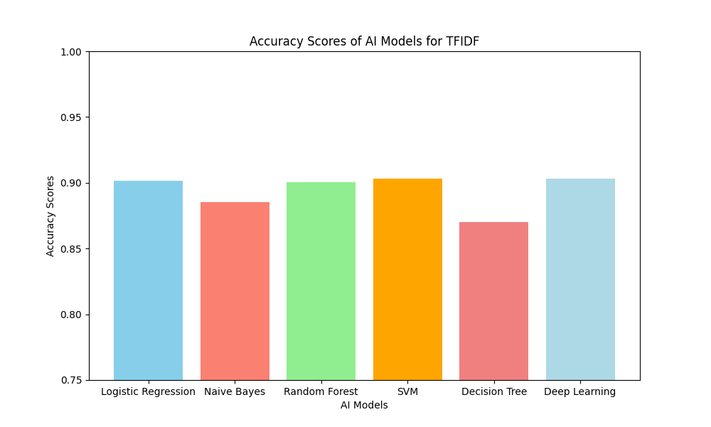
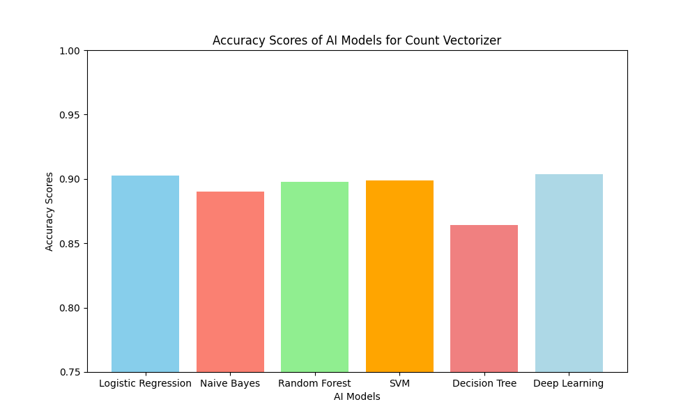
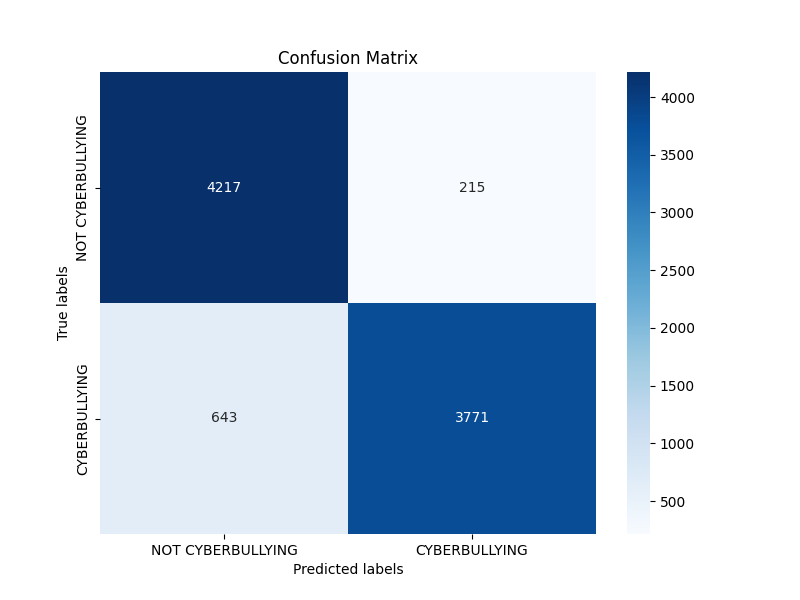
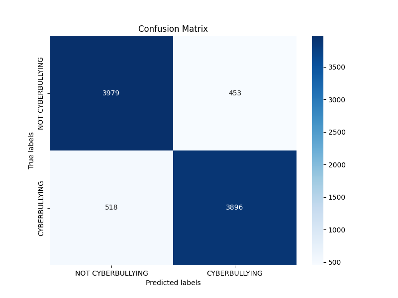
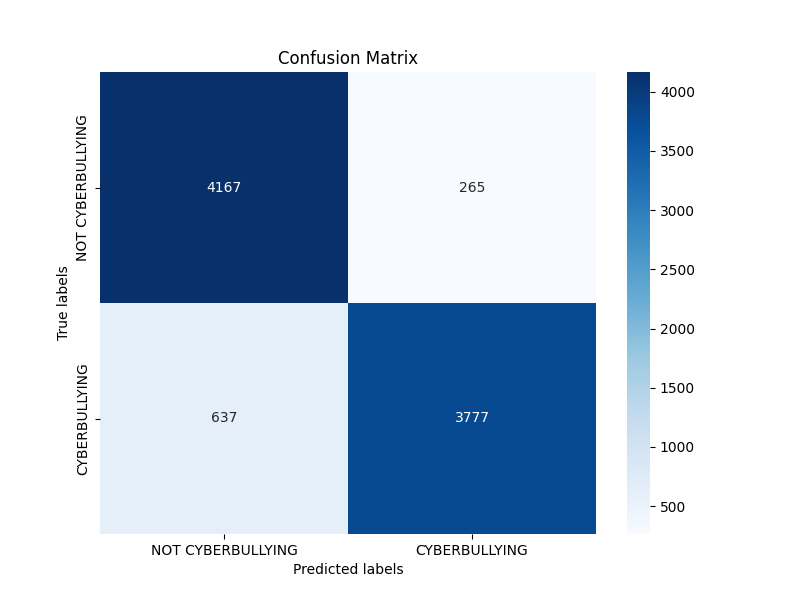
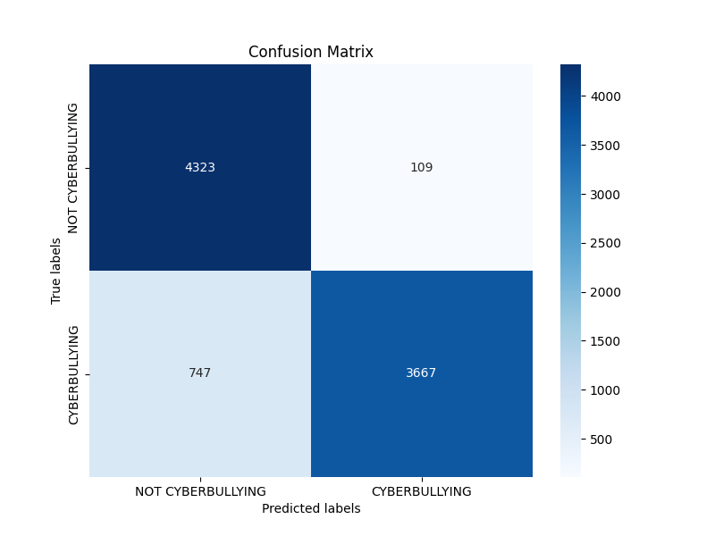
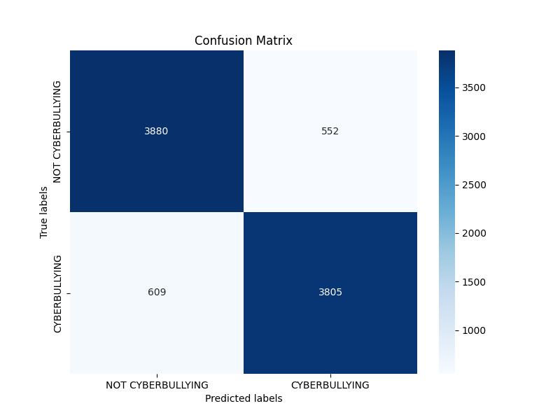
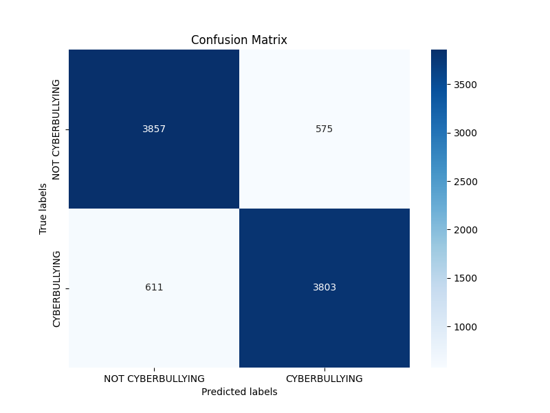
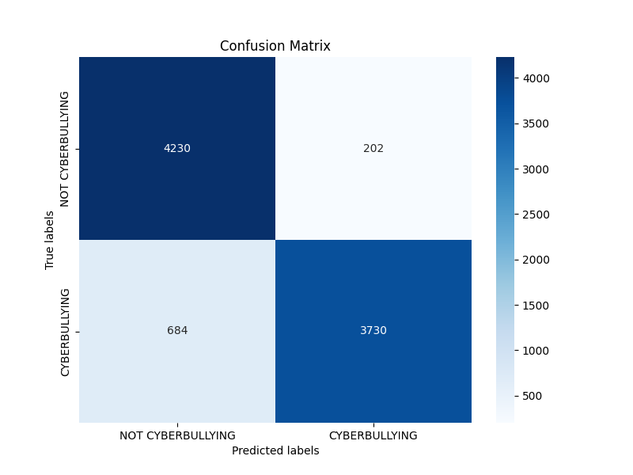

# YaHYaS

## İçindekiler
- [Giriş](#giriş)
- [Yöntem](#yöntem)
- [Bulgular](#bulgular)
- [Sonuç](#sonuç)

## GİRİŞ

Günümüzde sosyal medya uygulamalarının yaygın şekilde kullanımı, insanların birbirleri ile olan etkileşimini fazlasıyla artırmış durumdadır. Bu durum iyiye kullanıldığında oldukça güzel gelişmelere sebebiyet verebilirken, maalesef bu durum kötüye kullanıldığında insanlar üzerinde zannedilenden çok daha olumsuz sonuçlar doğurabilmektedir. İnsanların psikolojik sağlıklarını olumsuz etkileyebilecek şekilde yapılan yorumlar toplum yapısına da zarar vermektedir. Bu durumların önüne geçilebilmesi amacıyla projemde bu sorunu çözmek adına makine öğrenmesi algoritmaları ve derin sinir ağları modeli kullanarak metinlerde siber zorbalık tespiti yapmayı amaçladım.

Proje için kullanılan teknolojiler aşağıdaki gibidir:

- Python
- PyCharm
- Pandas
- Nltk
- Trnlp
- Gensim
- Sklearn
- Keras
- Numpy
- Matplotlib

## YÖNTEM

İlk olarak verilerin ham haliyle bulunduğu veri kümelerinde ilgili temizliğin ve gerekli ön işleme adımlarının yapılması için kullanılan fonksiyonlar `Process.py` dosyası içerisinde yer almaktadır. Ön işleme için ham veri kümesinde kullanılmayan id sütununun kaldırılması, Türkçe karakterlerin korunarak istenmeyen karakterlerin metin verilerinden kaldırılması, küçük harf dönüşümü, yanlış yazımı düzeltmek amacıyla normalizasyon işlemleri ve son olarak kök bulma (stemming) işlemleri uygulanmıştır.

Öznitelik Çıkarımı için işlenmiş veri kümesinden alınan verilerin vektörleştirme işlemi için kullanılan fonksiyonlar `FeatureExtraction.py` dosyası içerisinde yer almaktadır. Vektörizasyon için aşağıdaki metotlar ayrı ayrı uygulanmıştır:

- Term Frequency Inverse Document Frequency
- Count Vectorizer
- Doc2Vec
- Fasttext

Eğitim aşaması için oluşturulan vektör değerlerinin ilgili modellerin oluşturulması, modellerde eğitim, test ve doğrulama için gerekli fonksiyonlar `Model.py` dosyası içerisinde yer almaktadır. Bu aşamada aşağıdaki metotlar ayrı ayrı uygulanmıştır:

- Logistic Regression
- Naive Bayes
- Random Forest
- Support Vector Machine
- Decision Tree
- Deep Learning

## BULGULAR

Yapılan testler sonucunda, vektörizasyon yöntemlerinin yapay zeka algoritmaları üzerineki performansları hesaplanmıştır. 

Bu verilere ek olarak, FastText ve Doc2Vec yöntemleri ile eğitilen derin sinir ağı modeli yaklaşık olarak 0.78 ve 0.82 doğruluk değerlerinde kalmışlardır. Bu sebepten dolayı 'Tfidf' ve 'Count Vectorizer' vektörleştirme yöntemlerinin kullanımı daha doğrudur. Ayrıca eğitim sonucunda ortaya çıkan 'confusion matrix' değerleri aşağıdaki gibidir:

## SONUÇ

Siber zorbalığın ve saldırgan yorumların sosyal medya gibi ortamlarda çok fazla görüldüğü bu günlerde, bu gibi istenmeyen durumların tespit edilebilmesini kolaylaştırmak amacıyla çeşitli yöntemler karşılaştırılmıştır. Oluşturulan derin öğrenme modeli %90 üzerinde doğruluk değeri göstermektedir.
